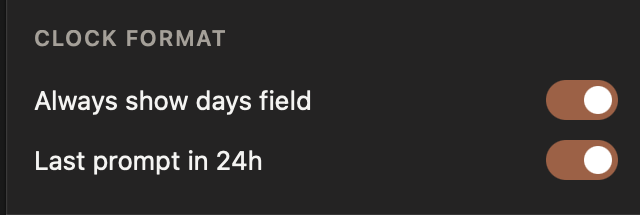

<div align="center">


# Claude Counter

**Live token counts, usage rings, and timing info — right on [claude.ai](https://claude.ai).**

[](#requirements)
[](#install-safari)
[](#chromium-browsers)
[](#firefox)
[](./LICENSE)


*Session & weekly usage rings with reset countdowns · context token bar · cache timer*

</div>

---

Safari doesn't let you install extensions from a zip like Chrome does — a Safari extension has to live inside a macOS app. This repo **is** that app: a thin native wrapper around the extension, ready to build with Xcode. The extension itself is plain cross-browser WebExtension JavaScript, so it also loads straight into Chrome, Brave, Edge, and Firefox with no build step — see **[Install on other browsers](#install-on-other-browsers)**.

## Features

| Feature | What it does |
|---|---|
| **Usage rings** | Session (5-hour) and weekly (7-day) usage from Claude's own API, with live reset countdowns. Reads the exact utilization fractions from Claude's SSE stream — more precise than the rounded numbers on the /usage page. A radial marker shows how far through each window you are. |
| **Context token bar** | Approximate token count for the current conversation against the model's context limit. The limit is auto-detected from the model you're using (1M-context models recognized), with a manual override. |
| **Hover token counts** | Hover any message to see its individual token count. |
| **Cache countdown** | How long the conversation stays prompt-cached (cheaper & faster to continue) after the last response. |
| **Last prompt time** | Timestamp of the last completed response. |
| **Light & dark themes** | Two independent colour palettes. The widget follows claude.ai's own light/dark setting automatically, or you can pin it to one. |
| **Fully configurable** | Colors, thresholds, ring appearance, position, clock formats, per-element visibility — all live from the toolbar popup. |

The widget only appears on chat pages (home, `/new`, `/chat/…`) and stays out of the way: it hides itself when an artifact or document panel would overlap it, and clamps to the viewport so it can never end up off-screen.

## Requirements

These apply to the **Safari** build only. Every other browser needs no Xcode, no macOS, and no compilation — jump to [Install on other browsers](#install-on-other-browsers).

- macOS 13 (Ventura) or later
- Safari 16.4 or later
- [Xcode](https://apps.apple.com/us/app/xcode/id497799835) (full app, not just Command Line Tools — `xcodebuild` ships only with Xcode)

## Install (Safari)

> Not using Safari? See **[Install on other browsers](#install-on-other-browsers)** for Chrome, Brave, Edge, Opera, Vivaldi, and Firefox.

### 1 · Clone and build

```sh
git clone https://github.com/monishram2508/claude-counter.git
cd claude-counter
./scripts/build.sh --open
```

This builds the app into `build/` and opens it. (Alternatively: open `Claude Counter.xcodeproj` in Xcode and press ⌘R.)

### 2 · Allow unsigned extensions

The build is ad-hoc signed (no paid Apple Developer account required), so Safari needs permission to load it:

1. Safari → Settings → **Advanced** → check **"Show features for web developers"**
2. Safari → Settings → **Developer** → check **"Allow unsigned extensions"** (asks for your password)

> [!WARNING]
> Safari resets **"Allow unsigned extensions"** every time Safari fully quits. If the widget disappears after a restart, re-enable it — your settings are kept.

### 3 · Enable the extension

1. Safari → Settings → **Extensions** → check **Claude Counter**
2. Click the Claude Counter toolbar icon → allow access for **claude.ai**
3. Open [claude.ai](https://claude.ai) — the widget appears in the top-right corner

**Updating:** `git pull && ./scripts/build.sh --open`, then re-enable the extension if Safari asks.

> [!TIP]
> Have an Apple Developer account? Select your team under *Signing & Capabilities* for both targets in Xcode — the extension is then properly signed and the "Allow unsigned extensions" step (and its reset-on-quit annoyance) goes away.

## Settings

Click the toolbar icon on any claude.ai tab. Everything applies live — no reload needed:

| Section | What you can change |
|---|---|
| **Theme** | Match Claude (default), always dark, or always light |
| **Colors** | Fill, track, warning, text, time-marker colors and tick opacity — set separately for dark and light mode |
| **Thresholds & behavior** | Warn percentage and style (recolor/pulse); auto vs. manual context limit |
| **Ring appearance** | Thickness, tick spacing, rounded caps |
| **Position & size** | Corner, offsets, width (always clamped on-screen) |
| **Show / hide** | Each element individually; chat-pages-only mode |
| **Clock format** | Days field, 12/24-hour |

<div align="center">
<table>
	<tr>
		<td align="center"></td>
		<td align="center"></td>
	</tr>
	<tr>
		<td align="center"></td>
		<td align="center"></td>
	</tr>
	<tr>
		<td align="center"></td>
		<td align="center"></td>
	</tr>
</table>
</div>

## How it works

- A small injected script wraps `window.fetch` on claude.ai to read the conversation tree, the `/usage` endpoint, and the live `message_limit` data in Claude's SSE stream. Nothing is modified — responses are cloned and parsed.
- Token counts use a vendored `o200k_base` tokenizer running entirely in the page, so counts are approximate but close.
- The model id is read from completion requests to pick the right context limit automatically.
- Theme is resolved from claude.ai's own markup where possible, and otherwise from the page background's measured brightness, so the widget stays readable even if the site changes how it flags light and dark mode.

## Privacy

- Everything stays local. **No external servers, no tracking, no analytics.**
- Network requests go only to `claude.ai` (the same API calls the page itself makes).
- The only cookie read is `lastActiveOrg`, used to query your usage endpoint.

## Troubleshooting

| Problem | Fix |
|---|---|
| Widget not showing | Are you on a chat page? It intentionally hides on settings/projects/etc. (toggle "Only show on chat pages" in the popup). After a Safari restart, re-enable "Allow unsigned extensions". |
| Text is hard to read after switching theme | The palette should follow claude.ai automatically. If it lags, set **Theme → Always light** (or dark) in the popup, and adjust that palette's colours to taste. |
| Widget disappeared mid-conversation | It auto-hides while an artifact or document panel overlaps it; close the panel and it returns. |
| Token bar seems wrong | The count is an approximation from a local tokenizer and excludes thinking blocks and images. Check the auto/manual context-limit setting if the percentage looks off. |
| "Manifest file is missing or unreadable" | You selected the wrong folder. Pick `Claude Counter Extension/Resources` — the folder that directly contains `manifest.json` — not the repo root. See [Install on other browsers](#install-on-other-browsers). |
| Extension vanished after restarting Firefox | Expected — Firefox discards temporary add-ons on quit. [Re-load it](#firefox). |
| Widget loads but every value stays blank | The bridge script couldn't reach the page. Open the console and look for a Content-Security-Policy error naming `bridge.js` — see the [Firefox note](#firefox). |

## Credits

- Token counting via [gpt-tokenizer](https://github.com/niieani/gpt-tokenizer) (MIT) — see [THIRD_PARTY_NOTICES.md](./THIRD_PARTY_NOTICES.md)
- Inspired by [Claude Usage Tracker](https://github.com/lugia19/Claude-Usage-Extension) by lugia19

## License

[MIT](./LICENSE) © Monishram Selvaraj

---

## Install on other browsers

Only Safari needs the Xcode build. Every other browser loads the extension folder directly — **no build step, no macOS requirement**.

The folder you point your browser at is always:

```
Claude Counter Extension/Resources
```

That's the folder containing `manifest.json`, **not** the repository root. Selecting the wrong one is the single most common install mistake.

| Browser | Method | Survives a restart? |
|---|---|---|
| Chrome, Brave, Edge, Opera, Vivaldi, Arc (any Chromium) | Load unpacked | Yes |
| Firefox 140+ | Load Temporary Add-on | **No** — re-load on every launch |
| Safari 16.4+ (macOS 13+) | [Build the app](#install-safari) | Yes, but re-enable the unsigned toggle |

### Get the files

Any browser, same first step:

```sh
git clone https://github.com/monishram2508/claude-counter.git
```

No Git? Use **Code → Download ZIP** on the GitHub page and unzip it somewhere permanent — the browser reads from this folder every launch, so don't delete it or install from Downloads you'll later clear.

### Chromium browsers

Chrome, Brave, Edge, Opera, Vivaldi, Arc, and any other Chromium-based browser share the same flow.

**1 · Open the extensions page**

| Browser | Address |
|---|---|
| Chrome | `chrome://extensions` |
| Brave | `brave://extensions` |
| Edge | `edge://extensions` |
| Opera | `opera://extensions` |
| Vivaldi | `vivaldi://extensions` |
| Arc | `arc://extensions` |

**2 · Turn on Developer mode**

Top-right toggle in Chrome, Brave, Vivaldi, and Arc. Bottom-left in Edge.

**3 · Load the extension**

Click **Load unpacked**, then select `Claude Counter Extension/Resources`.

**4 · Pin it and open Claude**

Click the puzzle-piece icon in the toolbar and pin **Claude Counter** so you can reach the settings popup. Then open [claude.ai](https://claude.ai) — the widget appears top-right.

> [!TIP]
> Chrome and Edge show a *"Disable developer mode extensions"* prompt on startup. Dismissing it is safe; the extension keeps working. To update after a `git pull`, click the reload (↻) icon on the extension's card.

### Firefox

Firefox needs **version 140 or newer** (set in the manifest, since the extension declares its data-collection status the modern way).

**1 · Open the debugging page**

Go to `about:debugging#/runtime/this-firefox`.

**2 · Load it**

Click **Load Temporary Add-on…**, then select the **`manifest.json` file itself** inside `Claude Counter Extension/Resources`. Firefox wants the file here, not the folder — this differs from Chrome.

**3 · Grant site access**

Open [claude.ai](https://claude.ai). If the widget doesn't appear, click the extensions (puzzle) icon → **Claude Counter** → allow access to claude.ai. Firefox treats host permissions in Manifest V3 as opt-in, so this step is often required.

> [!WARNING]
> **Firefox discards temporary add-ons when it quits.** You'll repeat these steps every launch. A permanent install requires the extension to be signed through [addons.mozilla.org](https://addons.mozilla.org); this repo isn't published there.

> [!NOTE]
> **Firefox support is unverified.** The manifest passes Mozilla's own `web-ext lint` with zero errors, but the extension works by injecting a small bridge script into the page, and claude.ai serves a strict Content-Security-Policy (`default-src 'none'`). Chrome and Safari exempt extension files from a page's CSP; if Firefox doesn't, the widget will render but every value stays blank. To check, open the console with **Ctrl+Shift+K** (**⌥⌘K** on macOS) and look for a CSP error naming `bridge.js`. If you hit it, please [open an issue](https://github.com/monishram2508/claude-counter/issues) — the fix is to declare the bridge as a `world: "MAIN"` content script.

### Updating

| Browser | How |
|---|---|
| Chromium | `git pull`, then click ↻ on the extension card |
| Firefox | `git pull`, then load the temporary add-on again |
| Safari | `git pull && ./scripts/build.sh --open` |
