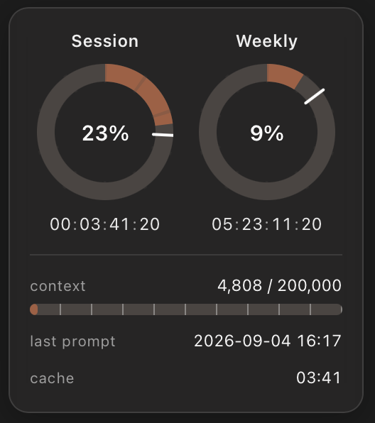
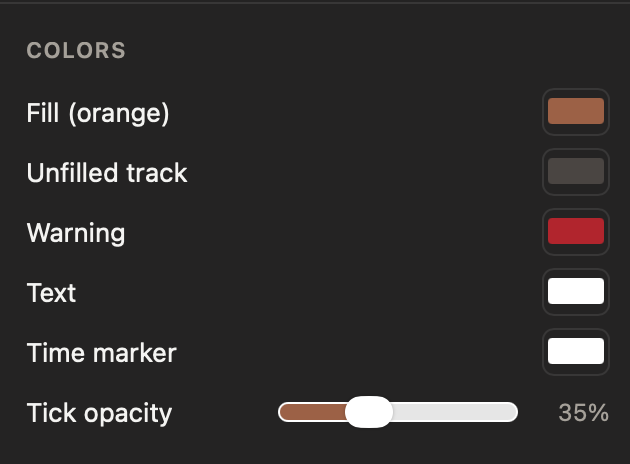
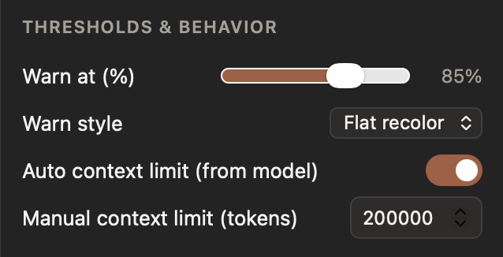
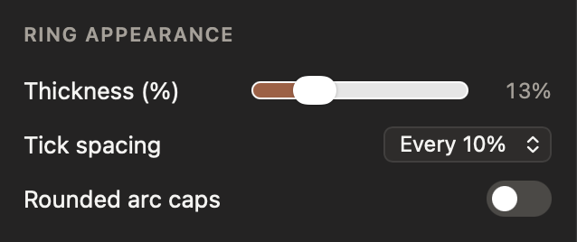
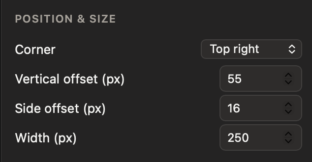
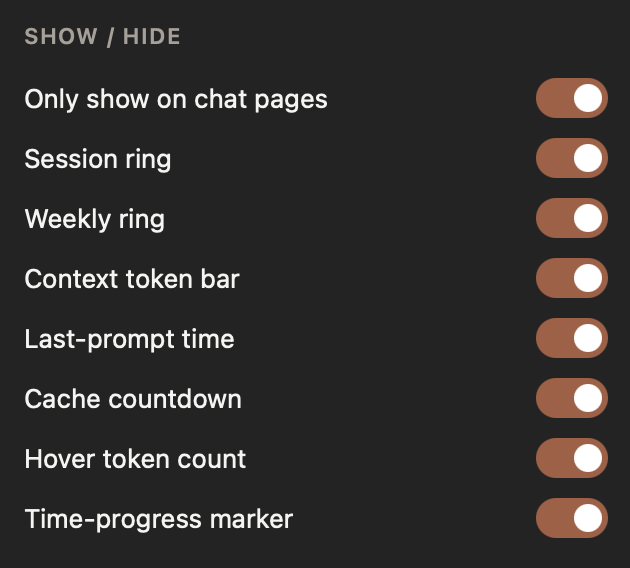
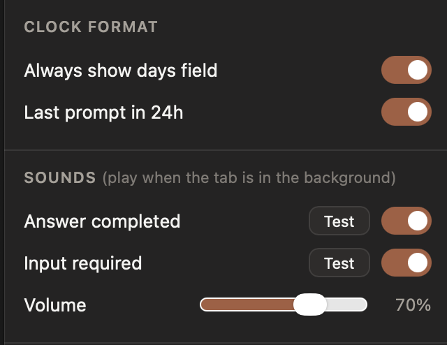

<div align="center">


# Claude Counter

**Live token counts, usage rings, and timing info — right on [claude.ai](https://claude.ai).**

[](#requirements)
[](#install-safari)
[](#install-chrome--edge--other-chromium)
[](./LICENSE)



*Session & weekly usage rings with reset countdowns · context token bar · cache timer*

</div>

---

Safari doesn't let you install extensions from a zip like Chrome does — a Safari extension has to live inside a macOS app. This repo **is** that app: a thin native wrapper around the extension, ready to build with Xcode. The extension itself is plain cross-browser WebExtension JavaScript, so it also loads straight into Chrome.

## Features

| | |
|---|---|
| **Usage rings** | Session (5-hour) and weekly (7-day) usage from Claude's own API, with live reset countdowns. Reads the exact utilization fractions from Claude's SSE stream — more precise than the rounded numbers on the /usage page. A radial marker shows how far through each window you are. |
| **Context token bar** | Approximate token count for the current conversation against the model's context limit. The limit is auto-detected from the model you're using (1M-context models recognized), with a manual override. |
| **Hover token counts** | Hover any message to see its individual token count. |
| **Cache countdown** | How long the conversation stays prompt-cached (cheaper & faster to continue) after the last response. |
| **Last prompt time** | Timestamp of the last completed response. |
| **Sounds** | Optional chime when a response finishes — played only when you're *not* looking at the tab. |
| **Fully configurable** | Colors, thresholds, ring appearance, position, clock formats, per-element visibility — all live from the toolbar popup. |

The widget only appears on chat pages (home, `/new`, `/chat/…`) and stays out of the way: it hides itself when an artifact or document panel would overlap it, and clamps to the viewport so it can never end up off-screen.

## Requirements

- macOS 13 (Ventura) or later
- Safari 16.4 or later
- [Xcode](https://apps.apple.com/us/app/xcode/id497799835) (full app, not just Command Line Tools — `xcodebuild` ships only with Xcode)

## Install (Safari)

### 1 · Clone and build

```sh
git clone https://github.com/monishram2508/claude-counter.git
cd claude-counter
./scripts/build.sh --open
```

This builds the app into `build/` and opens it. (Alternatively: open `Claude Counter.xcodeproj` in Xcode and press ⌘R.)

### 2 · Allow unsigned extensions

The build is ad-hoc signed (no paid Apple Developer account required), so Safari needs permission to load it:

1. Safari → Settings → **Advanced** → check **"Show features for web developers"**
2. Safari → Settings → **Developer** → check **"Allow unsigned extensions"** (asks for your password)

> [!WARNING]
> Safari resets **"Allow unsigned extensions"** every time Safari fully quits. If the widget disappears after a restart, re-enable it — your settings are kept.

### 3 · Enable the extension

1. Safari → Settings → **Extensions** → check **Claude Counter**
2. Click the Claude Counter toolbar icon → allow access for **claude.ai**
3. Open [claude.ai](https://claude.ai) — the widget appears in the top-right corner

**Updating:** `git pull && ./scripts/build.sh --open`, then re-enable the extension if Safari asks.

> [!TIP]
> Have an Apple Developer account? Select your team under *Signing & Capabilities* for both targets in Xcode — the extension is then properly signed and the "Allow unsigned extensions" step (and its reset-on-quit annoyance) goes away.

## Install (Chrome / Edge / other Chromium)

The extension folder works as-is, no build step:

1. Go to `chrome://extensions` and enable **Developer mode**
2. Click **Load unpacked** and select the `Claude Counter Extension/Resources` folder from this repo

## Settings

Click the toolbar icon on any claude.ai tab. Everything applies live — no reload needed:

| Section | What you can change |
|---|---|
| **Colors** | Fill, track, warning, text, time-marker colors; tick opacity |
| **Thresholds & behavior** | Warn percentage and style (recolor/pulse); auto vs. manual context limit |
| **Ring appearance** | Thickness, tick spacing, rounded caps |
| **Position & size** | Corner, offsets, width (always clamped on-screen) |
| **Show / hide** | Each element individually; chat-pages-only mode |
| **Clock format** | Days field, 12/24-hour |
| **Sounds** | Completion / input-required chimes, volume, test buttons |

<div align="center">
<table>
	<tr>
		<td align="center"></td>
		<td align="center"></td>
	</tr>
	<tr>
		<td align="center"></td>
		<td align="center"></td>
	</tr>
	<tr>
		<td align="center"></td>
		<td align="center"></td>
	</tr>
</table>
</div>

## How it works

- A small injected script wraps `window.fetch` on claude.ai to read the conversation tree, the `/usage` endpoint, and the live `message_limit` data in Claude's SSE stream. Nothing is modified — responses are cloned and parsed.
- Token counts use a vendored `o200k_base` tokenizer running entirely in the page, so counts are approximate but close.
- The model id is read from completion requests to pick the right context limit automatically.

## Privacy

- Everything stays local. **No external servers, no tracking, no analytics.**
- Network requests go only to `claude.ai` (the same API calls the page itself makes).
- The only cookie read is `lastActiveOrg`, used to query your usage endpoint.

## Troubleshooting

| Problem | Fix |
|---|---|
| Widget not showing | Are you on a chat page? It intentionally hides on settings/projects/etc. (toggle "Only show on chat pages" in the popup). After a Safari restart, re-enable "Allow unsigned extensions". |
| Widget disappeared mid-conversation | It auto-hides while an artifact or document panel overlaps it; close the panel and it returns. |
| No sound | Sounds only play when the tab is *not* focused, and Safari blocks audio until you've interacted with the page once. Use the popup's Test buttons to check volume. |
| Token bar seems wrong | The count is an approximation from a local tokenizer and excludes thinking blocks and images. Check the auto/manual context-limit setting if the percentage looks off. |

## Credits

- Token counting via [gpt-tokenizer](https://github.com/niieani/gpt-tokenizer) (MIT) — see [THIRD_PARTY_NOTICES.md](./THIRD_PARTY_NOTICES.md)
- Inspired by [Claude Usage Tracker](https://github.com/lugia19/Claude-Usage-Extension) by lugia19

## License

[MIT](./LICENSE) © Monishram Selvaraj
